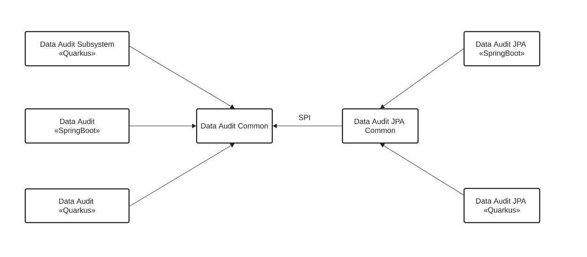

### Data Audit subsystem

This is the implementation of the Kogito Audit subystem. The subsystem allows to store events from issued by
- process engine
- user task
- job service

Main features are:

- runs as colocated services with quarkus and springboot
- module to write your own subsystem
- graphql modules to query data
- extension points to develop new storage easily
- extension points to develop new queries extending graphql definitions

## Design of the Data Audit

The system contains several modules and common modules to redistribute responsabilities.

Data Audit Common: Provides the common framework to create implementations.
Data Audit «Quarkus»: Provides the wiring to use Data Audit with Quarkus as colocated service (deployment)
Data Audit «SpringBoot»: Provides the wiring to use Data Audit with SpringBoot as colocated service (deployment)

Now we have and implementation examples

Data Audit JPA Common: Provides the common exension not depending on the runtime
Data Audit JPA «Quarkus»: Provides the wiring between the specific implementation and Quarkus System
Data Audit JPA «SpringBoot»: Provides the wiring between the specific implementation and Springboot colocated system

## Queries

The way to retrieve information from the data audit is using GraphQL. This way we can abstract how the information is retrieved and allow different needs depending on the user.

## JPA implementation

The jpa implementation allows you to store those events to be stored in a database.

## Extension Points

There are two different extensions. Those who belong to the runtime to wire things and those which does not depends on the runtime

Extension points depending on the runtime is:
org.kie.kogito.app.audit.spi.DataAuditContextFactory: this allows creating the context needed by a particular implementation.

Extension points not depending on the runtime:
org.kie.kogito.app.audit.spi.DataAuditStore: This is responsible to store the data in certain way
org.kie.kogito.app.audit.spi.GraphQLSchemaQuery<T>: This is responsible to execute a GraphQL query
org.kie.kogito.app.audit.spi.GraphQLSchemaQueryProvider: this allow the subsystem to identify additional queries provided by the end user

## How to use in with Quarkus/Springboot

You need to add two different dependencies to your project.

        <dependency>
            <groupId>org.kie.kogito</groupId>
            <artifactId>kogito-addons-data-audit-<runtime></artifactId>
            <version>${version}</version>
        </dependency>
        <dependency>
            <groupId>org.kie.kogito</groupId>
            <artifactId>kogito-addons-data-audit-jpa-<runtime></artifactId>
            <version>${version}</version>
        </dependency>
        
The first dependency is related how to you want to deploy it. In this case as collocated/embedded service
The second dependency is which implementation you want to use.

Each implementation might require additional dependencies. In our case for using JPA implementation we might require driver

        <dependency>
            <groupId>io.quarkus</groupId>
            <artifactId>quarkus-jdbc-h2</artifactId>
        </dependency>

No additional configuration is requires besides the default datasource use by the application already.

