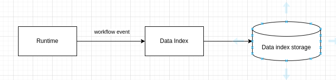

# Kogito Data Index Service

Data Index is a subsystem/component responsible to store a snapshot of the last state of the process instance state. 

The system supports two different types of deployment:
*   Compact Architecture: as component deployed within the application
*   Distributed Architecture: as component deployed independently as service

Due to the nature of the system it support different types of storage

*   postgresql
*   infinispan
*   mongodb
*   jpa

At present for compact configuration it only support quarkus runtime. For distributed supports both runtimes quarkus and springboot.

## Compact architecture

The next dependency is added for quarkus and being able to use in-vm transport tier
The next dependency is used to specify the storage of the data index and the transport tier at the same time.

	

    <dependency>
      <groupId>org.kie</groupId>
      <artifactId>kogito-addons-quarkus-data-index-persistence-postgresql</artifactId>
    </dependency>

	

As this dependency will include the storage as well and the in-vm transport.

	

    <dependency>
      <groupId>org.kie</groupId>
      <artifactId>kogito-addons-quarkus-data-index-persistence-<storage></artifactId>
    </dependency>

where storage can be:
*   infinispan
*   mongodb
*   postgresql

Current system

 

## Querying

Data index support queries through graphQL (basic.schema.graphqls). For using the endpoint you just need to explore in your deployment the URI:

http://localhost:8080/<root path>/graphql-ui/

to start working with the queries defined by the schema aforementioned.

## Distributed deployment

For distributed you need to specify and addons you will need to deploy the data index as service and include the event publisher

	

     <dependency>
        <groupId>org.kie.kogito</groupId>
        <artifactId>kogito-addons-springboot-events-process-kafka</artifactId>
     </dependency>

	

of for quarkus
	

     <dependency>
        <groupId>org.kie.kogito</groupId>
        <artifactId>kogito-addons-quarkus-events-process-kafka</artifactId>
     </dependency>

	

More information about the Data Index images in here:
[https://github.com/apache/incubator-kie-kogito-images?tab=readme-ov-file#kogito-data-index-component-images](https://github.com/apache/incubator-kie-kogito-images?tab=readme-ov-file#kogito-data-index-component-images images)

