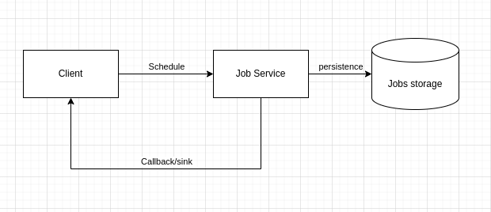

# Jobs

job service represents a subsystem within kogito workflow domain. This component is responsible for scheduling jobs. In the case of workflow this module takes care of timers such from boundary events, SLA, throw events relevant to timers. Also is used for things like human tasks notifications.

The system supports two different types of deployment:

*   Compact Architecture: as a component deployed within the application.
*   Distributed architecture: as a microservice deployed independently

The current support storage is

*   postgresql
*   infinspan
*   mongodb
*   in memmory

At present jobs only supports quarkus runtimes in compact architecture.

## How jobs work

 

The concepts to understand the above picture are:
*   transport: the medium used to transfer a message between client component and job service. The transport could be http, kafka or in-vm at the moment.
*   sink: is the client endpoint callback.
*   storage: is the persistence tier of the jobs being current scheduled.
*   job service: it the main component containing the logic of scheduling a job and storing data.

When a client invokes the job service the client component send a message through the transport tier containing the information required in order to call back the sink once the job times out.
Once the request reaches the job service it creates internally the job and stores the data about the job status in the storage.
After the job times out, the component calls the sink signaling the client using either in-vm or http request.

## Using job service as Compact architecture

For using in your project this you need first to include the dependency related to the transport tier. in our case for in-vm we use 

	
    <dependency>
      <groupId>org.kie</groupId>
      <artifactId>kogito-addons-quarkus-jobs-management</artifactId>
    </dependency>
    <dependency>
      <groupId>org.kie</groupId>
      <artifactId>kogito-addons-quarkus-jobs</artifactId>
    </dependency>

	

after that we need to include the storage we want to use. For instance we are using postgresql

	

    <dependency>
      <groupId>org.kie.kogito</groupId>
      <artifactId>jobs-service-postgresql-common</artifactId>
    </dependency>

	
In this case for postgresql in-vm it will use automatically your main data source available.
Here you have an example of this configuration:

	

	kogito.persistence.type=jdbc
	quarkus.datasource.db-kind=postgresql
	quarkus.datasource.username=kogito-user
	quarkus.datasource.password=kogito-pass
	quarkus.datasource.jdbc.url=${QUARKUS_DATASOURCE_JDBC_URL:jdbc:postgresql://localhost:5432/kogito}
	quarkus.datasource.reactive.url=${QUARKUS_DATASOURCE_REACTIVE_URL:postgresql://localhost:5432/kogito}

	

> Note: you need to us managed dependencies, otherwise you need to specify the version of the dependencies.

> Note: in case you are using other service like MongoDB, check you need to configure the storage with the proper properties. The components uses the common quarkus 

> Note: in the case of ddl scripts for pgsql you can find it in `jobs-service-postgresql-common/src/main/resources/db/jobs-service`

## Distributed deployment

For distributed deployment job service offers already builtin docker images. This images are based on the repository

*   [Kogito Images](https://github.com/apache/incubator-kie-kogito-images)
*   [Kogito Job Images](https://github.com/apache/incubator-kie-kogito-images?tab=readme-ov-file#kogito-jobs-service-component-images)

And you need to setup a few things in the client side of things:

	

	kogito.jobs-service.url=http://localhost:8580

	

