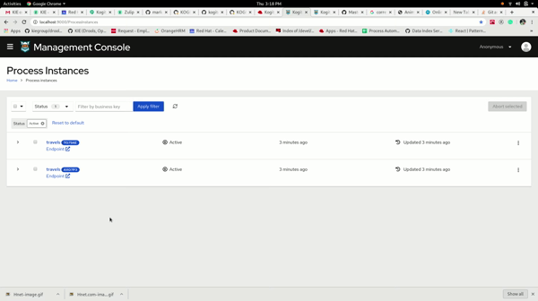
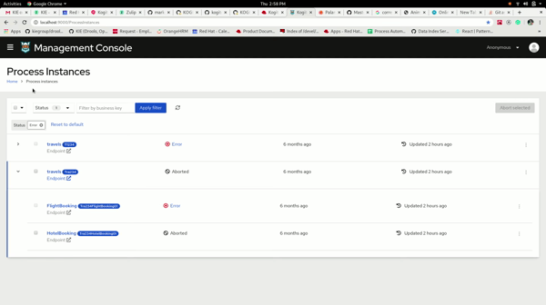
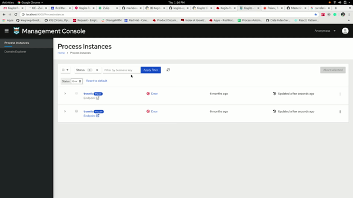

# management-console project

This project uses Quarkus, the Supersonic Subatomic Java Framework.

If you want to learn more about Quarkus, please visit its website: https://quarkus.io/ .

## Running the application in dev mode

You can run your application in dev mode that enables live coding using:
```
mvn quarkus:dev
```
Note: Live coding of the React JS frontend application is not yet in place.

## Packaging and running the application

The application is packageable using:
```
mvn package
```
It produces the executable `management-console-8.0.0-SNAPSHOT-runner.jar` file in `/target` directory.
Be aware that it’s not an _über-jar_ as the dependencies are copied into the `target/lib` directory.

The application is now runnable using:
```
java -jar target/management-console-8.0.0-SNAPSHOT-runner.jar
```

## Creating a native executable

You can create a native executable using: 
```
mvn package -Dnative
```

Or you can use Docker to build the native executable using:
```
mvn package -Dnative -Dquarkus.native.container-build=true
```

You can then execute your binary: `./target/management-console-8.0.0-SNAPSHOT-runner`

If you want to learn more about building native executables, please consult https://quarkus.io/guides/building-native-image-guide .

## Packaging together with the React app

The application makes use of a separately developed [React UI application](../ui-packages/packages/management-console/package.json). The JS based frontend can be built as part of the build of this project by using the profile defined in dependency [ui-packages](../ui-packages/pom.xml), invoked by default. Using the property `-Dskip.ui.build` as in following command you can skip the build of UI and use what is already built in the respective package:
```
mvn package -Dskip.ui.build
```

To prepare all the dependencies needed for the build of UI, there's a maven profile activated by default. Using the `-Dskip.ui.deps` property you can skip the profile.


The single command to disable both UI build related profiles is:
```
mvn package -Dskip.ui.deps -Dskip.ui.build
```

## Creating a native executable
The native build of the application bundling in the React JS frontend does not differ from the instructions above. The only thing that's new is again the invocation of UI specific profiles.
```
mvn package -Dui -Dnative
```

## Working with management-console features

### Process instances
The process instances page shows the list of process instances available. The list is an expandable list , which shows all the child process instance of the particular process instance when expanded. Each row in the list contains the information about the process instances. The info includes details like *name*, *status*, *endpoint* etc... The list also provides many ways to [filter](#filters) out the process instances and also to perform [process-management](#process-management) operations to the processes. The details of them are mentioned below.

#### Filters


It has two ways of filtering the list:
* filter by status (a checkbox based filter)
* search by Business key (a textbox based filter)
These two filters can be used in combination to filter the list.

##### a) Filter by status :


There are five status in total :
 * Active
 * Completed
 * Aborted
 * Suspended
 * Error
 
Initially the process instance list loads all the active instances available.To search using different filters, click on the dropdown with the **Status** tag and select the necessary status from the drowdown. Click on **Apply filter** to load the new list.Also there is a **chip array** below the filters to show the current filters applied. The filters for status can be removed by either by deselecting the options from the dropdown and clicking on **Apply filter** or by clicking on the '**X**' in the chip.

##### b) Filter by business key :
  

  The business key is a business relevant identifier that might or might not be present in the process instance. The business key, if available would appear as a **blue coloured badge** near the process name in the list. We can enter the business key or parts of business key in the textbox and either click **Apply filter** or press **Enter** key to apply the filter. Similar to the Status filter, the chips with the typed keywords would appear below the textbox. The search for business key works on a *OR* based condition. Also to remove a filter based on the keyword, click on the '**X**' in the chip to remove and the list will reload to show the applied filter. The search supports [Wild cards](https://en.wikipedia.org/wiki/Wildcard_character "Wild cards") in its keywords. For example, consider a process having a business key as *WIOO2E*. This business key can be searched by entering *W\** or *\*OO\** or *WIOO2E*. 

#### Bulk Process Actions


  The multi select is used to select multiple process instances while performing bulk [process-management](#process-management) actions.The multi select checkbox by default selects all the parent and child process instances(if loaded). It also has drop-down actions to select none (removes all selections), select only parent process instances, select all the process instances (both parent and child). The multi-select works in correlation with the **Aborted** **selected** button which is present in the top-right corner.This is a part of the [bulk operations](#bulk-operations) performed in the list.

  
  
  The process instance list allows the user to select multiple process instances and perform bulk process management operations.It consist of *Abort selected*.The user can select individual process instances by selecting the checkbox present in the list or use the [multi select checkbox](#multi-select-checkbox) to select the process instances.Then clicking on the *Abort selected* will open a box to show the instances being aborted and the instances being skipped(An instance which is already in *Completed* or *Aborted* cannot be Aborted again, hence the instances are skipped).

In addition to these , there is a **reload** button(a sync-icon), to reload the list and a **Reset to default** button which resets all the filters to its original state(Active status and no business key filter).

**Note :** all the filters are applied only to the parent process instances.

#### Process list


  The List shows details of the process instances. Initially it loads only the parent process instances. The following are the details shows in the list :
  * Checkbox
  * Process name
  * State of the process
  * when was the process created
  * when was the process updated
  * a kebab button to provide [process-management](#process-management) functions
  
  The list has a toggle button on the left end, which when toggled would load all the child process instances of that parent process instance.
  The child process instance also has a similar sturcture as mentioned above.

  **Checkbox** - A checkbox to select the process instance to perform [process-management](#process-management) operations. Checkboxes which are disabled either do not have `kogito.service.url` missing or the `process management` capability is disabled.

  **Process name** - It shows the process name of the instance along with the business key (as a blue badge) if available. If business key is absent, then it shows
  the spliced process instance id(spliced to 5 chars). When hovered over the process name ,a tooltip with the full process instance id pops up.

  **Status** - The process status along with their corresponding icons is shown. For instances in **Error**, a pop over shows up with the corresponding error message. Also there is a provision to either Skip or Retry the error instance.

  **Process** **Created** - This shows the time elapsed from the process creation.

  **Last** **Updated** - This shows the time elapsed from the last update.

  **Kebab** **button** - The kebab button is enabled or disabled based on the process instance status and the contents of the kebab button varies based on the process-management capability provided to the particular instance. It consists of Abort, Skip and Retry.  

#### Process management

  There are currently three process management capabilities in the process instance list.
  * Abort
  * Skip
  * Retry

  ##### Abort : 
  An instance which is either in *Active*, *Error*, *Suspended* state can be aborted. Clicking on the abort would open up a box displaying the instance which was aborted.
  #### Skip :
  A node in *Error* state can be skipped. Clicking on the skip would open up a box displaying the success or failure status of the skip operation.
  #### Retry :
  A node in *Error* state can be Retriggered. Clicking on the Retry would open up a box displaying the success or failure status of the Retry operation.

  ### Process instance Details

  

  The process details page consist of the following :

  #### Heading
  The heading shows the name of the process instance. The heading also shows the business key(if available) as a blue coloured badge. 
  In the absence of business key it shows the process instance id as a concatenated string.

  #### Process management buttons
  The process management buttons consist of the following
  * *Abort* - Abort button aborts the process instance. Clicking on abort button results in opening a checkbox to show the process instance which was aborted.

  #### Details
  The details consist of the following :

  * *Name* - shows the name of the travels
  * *BusinessKey* - shows the business key if available
  * *State* - shows the current state of the process instance
  * *Id* - shows the full unique id of the process instance
  * *Endpoint* - Shows the endpoint of the backend to which the client is connected
  * *Start* - shows the time elapased from the start of the process
  * *End* - shows the time elapased from the end of the process(if available)
  * *Parent process* - shows if the current process instance has a parent process. Allows navigation to the parent process when clicked on. Shows the unique id when hovered over.
  * *Sub processes* - shows if the current process instance has sub processes.Allows navigation to the respective child process when clicked on. Shows the unique id when hovered over

  #### Timeline
  The timeline shows the timeline of all the nodes of a process.It shows the state of the node(*Active* or *Completed* or *Error*), the name of 
  the node(*User Icon* on the side for user tasks ) and a kebab button. The nodes in *error* are shown(hovering over the error icon would sho the error message) can be *skipped* or *retriggered* by selection the required option from the kebab toggle.

  #### Process variables
  The process variables shows the domain data in *JSON* format.

## Domain Explorer

Domain Explorer allows you to inspect domain related data and process instances based on domains that are available.

You can navigate to Domain Explorer by clicking "**Domain Explorer**" tab available on the sidebar, which will take you landing page of
domain explorer and there you can see a list of available Domains.


Selecting a domain on the landing page will direct you to a dashboard, where you can view all domain related data and list of processes associated with it.


### Column Picker

Domain Explorer allows you to select the domain attributes that you wish to see on the result table.

This column picker is a multi select dropdown that contains the available domain attributes, that allows you to select any number of options available in the dropdown, there are few options that are selected by default which can be changed of your choice. The options available in the dropdown follows a certain nested pattern, displayed the entire graph of attributes available in the specific domain.

eg: "**hotel/address**" denotes address attribute of hotel.

After selecting/deselecting options from the dropdown, clicking on "**Apply columns**" would get you domain data on the table.


### Refresh option

There can be a possibilites of,
* change in state of processes, while performing operations like skip, retry or abort
* New process instance being added.

In order to check the current state of processes or current list of processes available on the domain you can always do a refresh of the table by clicking icon placed next to Apply columns button. This will get you current and updated content to the table.


### Dashboard

The table on the Domain Explorer will provide you information about the specific domain data and list of processes associated with it.

To check the list of processes, you may have to expand each row of the table by clicking on the **carret** icon available on each row.


### Navigate to process details

To get to know more about a process, you can always click on any process instance to direct to process details page and there you can see details about the process as well as the timeline and process variables.


