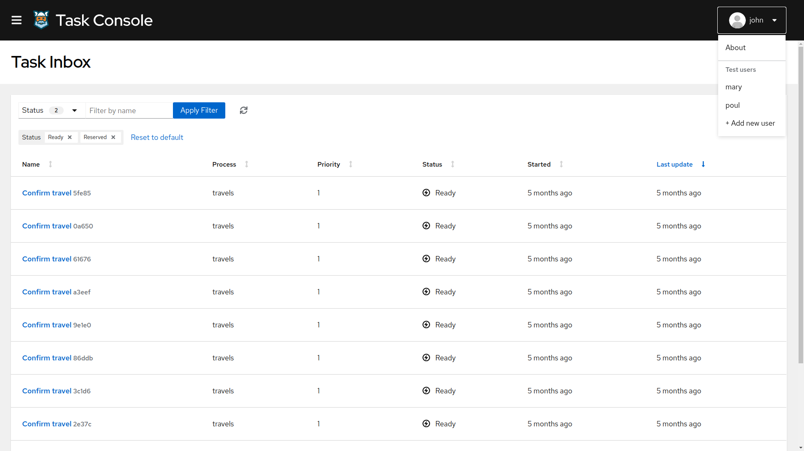
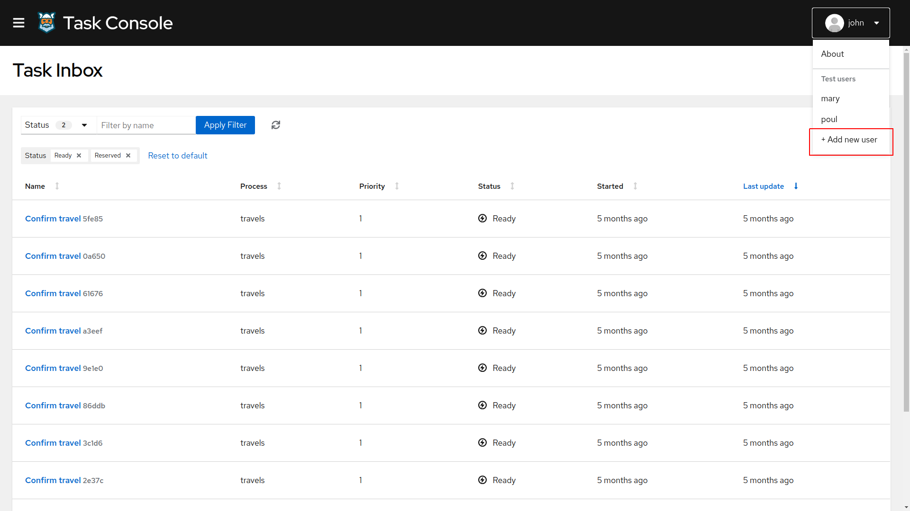
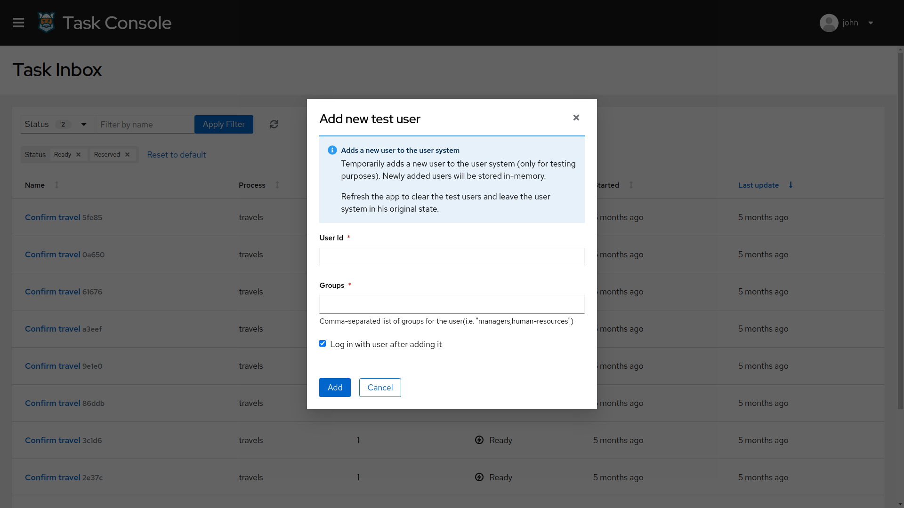

# task-console project

This project uses Quarkus, the Supersonic Subatomic Java Framework.

If you want to learn more about Quarkus, please visit its website: https://quarkus.io/ .

## Running the application in dev mode

You can run your application in dev mode that enables live coding using:
```
mvn quarkus:dev
```
Note: Live coding of the React JS frontend application is not yet in place.

## Packaging and running the application

The application is packageable using:
```
mvn package
```
It produces the executable `task-console-8.0.0-SNAPSHOT-runner.jar` file in `/target` directory.
Be aware that it’s not an _über-jar_ as the dependencies are copied into the `target/lib` directory.

The application is now runnable using:
```
java -jar target/task-console-8.0.0-SNAPSHOT-runner.jar
```

## Creating a native executable

You can create a native executable using: 
```
mvn package -Dnative
```

Or you can use Docker to build the native executable using:
```
mvn package -Dnative -Dquarkus.native.container-build=true
```

You can then execute your binary: `./target/task-console-8.0.0-SNAPSHOT-runner`

If you want to learn more about building native executables, please consult https://quarkus.io/guides/building-native-image-guide .

## Packaging together with the React app


The application makes use of a separately developed [React UI application](../ui-packages/packages/task-console/package.json). The JS based frontend can be built as part of the build of this project by using the profile defined in dependency [ui-packages](../ui-packages/pom.xml), invoked by default. Using the property `-Dskip.ui.build` as in following command you can skip the build of UI and use what is already built in the respective package:

```
mvn package -Dskip.ui.build
```

To prepare all the dependencies needed for the build of UI, there's a maven profile activated by default. Using the `-Dskip.ui.deps` property you can skip the profile.

The single command to disable both UI build related profiles is:
```
mvn package -Dskip.ui.deps -Dskip.ui.build
```

## Creating a native executable
The native build of the application bundling in the React JS frontend does not differ from the instructions above. The only thing that's new is again the invocation of UI specific profiles.
```
mvn package -Dui -Dnative
```

## Enabling Keycloak security

### Starting and Configuring the Keycloak Server

To start a Keycloak Server you can use Docker and just run the following command:

```
docker run -e KEYCLOAK_USER=admin -e KEYCLOAK_PASSWORD=admin -e KEYCLOAK_IMPORT=/tmp/kogito-realm.json -v {absolute_path}/kogito-apps/config/kogito-realm.json:/tmp/kogito-realm.json -p 8280:8080 jboss/keycloak
```

You should be able to access your Keycloak Server at [localhost:8280/auth](http://localhost:8280)
and verify keycloak server is running properly: log in as the admin user to access the Keycloak Administration Console. 
Username should be admin and password admin.

To change any of this client configuration access to http://localhost:8280/auth/admin/master/console/#/realms/kogito.

### Starting Kogito Task Console in dev mode

Start the task console at port 8380, (the keycloak client 'kogito-console-quarkus' is configured to use that port )
and enabling auth:

```
mvn clean compile quarkus:dev -Dquarkus.http.port=8380 -Dquarkus.profile=keycloak
```
## Enabling Test User System

Management Console and Task Console include a Test User System to be used only for testing purposes. It provides a set of
predefined users, ability to switch users and ability to add new users (stored in-memory).

It's possible to enable it by adding the parameter `kogito.test.user-system.enabled=true`, for example:

```
mvn clean compile quarkus:dev -Dquarkus.http.port=8380 -Dkogito.test.user-system.enabled=true
```

> _**NOTE**_: The Test User System won't be available when starting the application with `keycloak` profile.

### Switching to a different user

The Test User System provides a set of predefined users that can be used:

|   User   |       Groups      |  
|----------|-------------------|
|   john   |     employees     |
|   mary   |      managers     |
|   poul   | interns, managers |

Open the available users list by clicking on the top right **User Avatar**, then click on any of the
users to switch to that user.



### Adding new test users

To register new users to the Test User System just click on the top right **User Avatar** and click **+ Add new User**
to open the **New Test User** modal.



When the **New Test User** form appears, fill the **User Id** field with the new user id and the **Groups** with a comma-separated
list of groups you want the user to belong and press **Add** to proceed register the user. 



> _**NOTE**_: The users stored in Test User System are stored in-memory, refreshing the screen will restore the user system
>to its original state. 